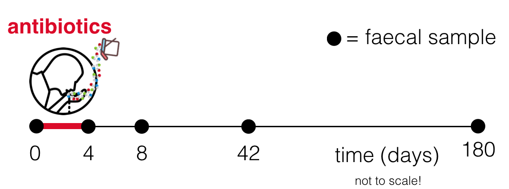

# Introductory microbiome practical

This repository contains an introduction to microbiome analysis in R, originally written for the UCL course *Molecular epidemiology for infectious diseases* (GLBH0034).

By the end of the practical, we will cover the basics of how to: 

* Read in microbiome data 
* Perform ordinations 
* Calculate diversity indices
* Analyze differential abundances 

We will reanalyse a microbiome dataset generated as part of the following study:

**Recovery of gut microbiota of healthy adults following antibiotic exposure**
Palleja et al. (2018) *Nature Microbiology* 3, 1255-1265
doi: [s41564-018-0257-9](https://doi.org/s41564-018-0257-9)

The aim of this study was to see how the gut microbiome recovers after a course of antibiotics. Palleja et al. gave twelve healthy male adults a four-day course of three antibiotics: meropenem, gentamicin and vancomycin. This mix was ingested once-daily via apple juice. The particular combination of antibiotics was chosen as '*a modified version of prophylactic antibiotic protocols from intensive care units*'. This would therefore be expected to significantly deplete the gut microbiome. 

Palleja et al. then collected faecal samples before (D0), after (D4), and at three further time points after treatment: 8 days (D8), 42 days (D42), 180 days (D180). Samples were analysed with shotgun metagenomics. 

The practical can be found as an Rmarkdown file `microbiome-practical.Rmd` or html: `microbiome-practical.html`
