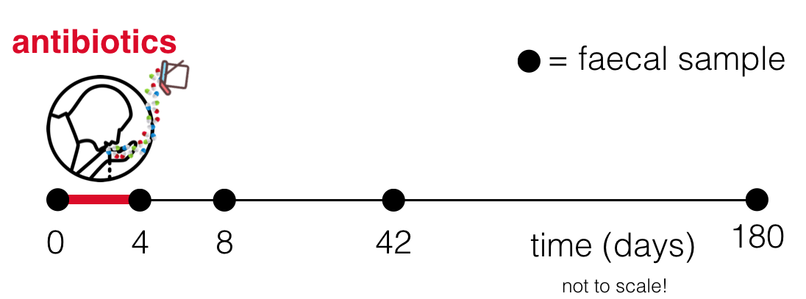

***
**About this document:** *This is an Rmarkdown notebook which includes `code` as well as explanation. It can be used to generate a html document which can be viewed in a browser. From this, you should be able to copy and paste the code into RStudio and run it yourself if you have cloned the github repository. You can also open the underlying `.Rmd` document in RStudio and edit it yourself, and run the code chunks.*

***

# Introduction 

In this practical, you will learn how to use R to analyse microbiome data. The intention is to give a grounding in the basics while also thinking about some interesting science. 

By the end of the practical, you should be able to: 

* Read in microbiome data 
* Perform ordinations 
* Calculate diversity indices
* Analyze differential abundances 

We will reanalyse a microbiome dataset generated as part of the following study:

**Recovery of gut microbiota of healthy adults following antibiotic exposure**
Palleja et al. (2018) *Nature Microbiology* 3, 1255-1265
doi: [10.1038/s41396-019-0392-1](https://doi.org/10.1038/s41396-019-0392-1)

The aim of this study was to see how the gut microbiome recovers after a course of antibiotics. Palleja et al. gave twelve healthy male adults a four-day course of three antibiotics: meropenem, gentamicin and vancomycin. This mix was ingested once-daily via apple juice. The particular combination of antibiotics was chosen as '*a modified version of prophylactic antibiotic protocols from intensive care units*'. This would therefore be expected to significantly deplete the gut microbiome. 

{#id .class width=50% height=50%}

Palleja et al. then collected faecal samples before (D0), after (D4), and at three further time points after treatment: 8 days (D8), 42 days (D42), 180 days (D180). Samples were analysed with shotgun metagenomics. 

We will explore this microbiome dataset using some R commands. Let's get started!

# Reading in microbiome data

First, we will load in some R packages. These contain useful functions which supplement the basic R functions. If you do not have these, you will have to install them with e.g. `install.packages('vegan')`. 

```{r libraries, message=FALSE}
library(vegan) # Community ecology package, containing tools for diversity analysis, ordination and analysis of dissimilarities
library(ggplot2) # Plotting package
library(Matrix) # Matrix classes and methods
library(reshape2) # Reformatting datasets
```

This practical assumes some level of familiarity with R and is not an introduction to the R programming language. However, it contains a reasonable amount of explanation about what the lines of code are doing, so even if you have never seen R code before it should make some sense. 

We will read in the : **m**etagenomic **O**perational **T**axonomic **U**nits (mOTU) abundance data as provided by Palleja et al. Before doing so, it's worth understanding what their methods were for reaching these mOTU abundances. 

Throughout this practical, there are <span style="background-color:#EFD31C">questions</span> about the material. Click on **Show answer** to reveal the answer - but do have a go at thinking about it first!

<br>
<span style="background-color:#EFD31C">
**Question:** From the paper, how were mOTU abundances calculated? What is the advantage of this method compared to 16S rRNA marker gene screening? 
</span>
<details>
  <summary>**Show answer**</summary>

* From the paper: 'Screened high-quality reads were aligned (alignment length cut-off of 45 bp and minimum 97% sequence identity for the option 'screen') to a database consisting of 10 universal single-copy marker genes extracted from 3,496 NCBI reference genomes and 263 metagenomes'. 
* The advantage of this method is that it uses multiple genes rather than a single marker gene (such as the 16S rRNA gene) so is more reliable for differentiating closely-related mOTUs.
</details>

<br>
In the lecture, we talked about rarefying microbiome data. This is the process of subsampling to the same number of reads per sample.

<span style="background-color:#EFD31C">
**Question:** Why is rarefying sometimes important, and sometimes problematic? How were the data rarefied in this instance?
</span>
<details>
  <summary>**Show answer**</summary>

* Ensuring the same sequencing depth in each sample matters if you want to calculate diversity in a consistent way across samples. However, rarefying removes information on variance of mOTU counts between samples. 
* Palleja et al. write that 'Samples were rarefied to 14 million inserts'. This means that each sample had 14 million paired-end reads (2 x 100 base pairs). In practice, this is very large compared to a lot of microbiome datasets and so rarefying is less of an issue here (apart from for very low abundance mOTUs).
</details>

<br>
We now read in the dataset of mOTUs.

```{r mOTUs}
mOTUs <- read.csv('data/annotated.mOTU.rel_abund.rarefied.tsv',
                    sep='\t', 
                    header=T, 
                    row.names = 1)
```

Some explanation of the above code: 

* `read.csv` is a base R function (i.e. comes with R, not a package) which reads in a **c**omma **s**eparated **v**alue format dataset. However, the file we are reading in is **tsv**: **t**ab **s**eparated **v**alue (as you'll see if you open the file in a text editor)
* `sep='\t'` is an argument which tells `read.csv` the column separator is tab rather than the default comma
* `header=T` is an argument which tells `read.csv` that the file has a header row (the first row) with names of the different columns
* `row.names=1` is an argument which tells `read.csv` that the first column contains the row names of the dataset.

Let's inspect the dataset to see what it looks like. First, let's look at the column names:

```{r inspect_dataset_1}
head(colnames(mOTUs))
```

`head` by default prints the first 6 of an object (whether rows/entries) which is handy for inspecting things in R to check they're as expected, without printing everything. The column names have the format `patientID_day` e.g. `ERAS9_D4` means the sample taken from patient `ERAS9` on day 4 (immediately after the course of antibiotics finished).

<span style="background-color:#EFD31C">
**Question:** Which command using `head` would show the first 10 columns of the dataset?
</span>
<details>
  <summary>**Show answer**</summary>
  
`head(colnames(mOTUs), n=10)`
</details>

<br>
Now, let's look at rownames:

```{r inspect_dataset_2}
head(rownames(mOTUs))
```

These are bacterial mOTUs.

So, we have a dataset where columns are samples and rows are bacterial mOTU: an 'OTU table' like in the lecture. The entries are relative abundances for each mOTU within a sample, which means that the sum of each column is 1 (total relative abundance within a sample is 1 by definition). We can check this.

```{r column_sums}
head(colSums(mOTUs))
```

If we look at the dataset in more detail, we can inspect the relative abundances for individual mOTUs.

```{r inspect_dataset}
head(mOTUs[,c("ERAS3_D0","ERAS3_D4")])
```

Here, `mOTUs[,c("ERAS3_Dag0","ERAS3_Dag4")]` selected two columns of the dataset from patient ERAS3. We then see that e.g. the mOTU *Actinomyces odontolyticus* was present at a relative abundance of 0.0003927314 (=0.39%) on day 4 but was not present in the sample from day 0. 

<span style="background-color:#EFD31C">
**Question:** What is the smallest possible number of sequencing inserts (paired-end reads) from a mOTU that would mean it could be present in the dataset (the 'limit-of-detection' or 'detection threshold')?
</span>
<details>
  <summary>**Show answer**</summary>

* Any mOTU detected must have at least 1 insert. 
* 14 million inserts in each sample.
* So any mOTU detected must be at an abundance of 1 in 14 million which is ~ 0.000007%.
* This is a lower bound: the true values will be greater than this (for example, if 10 marker genes then could need at least 10 inserts to cover them, and in reality multiple inserts per gene) 
* Note from the paper that 'at least 11.9 million read-pairs were mapped to IGC [integrated gene catalog of gut microbial genes]', so Palleja et al. write it would be 'on the order of 1 in 10 million'. 
* This is quite low for a microbiome study; for example, with only 10,000 reads per sample (common in 16S rRNA gene studies) you would have a detection threshold of (1/10,000 * 100)% = 0.1%.  
</details>


# Performing ordinations

## NMDS

We can use nonmetric multidimensional scaling (NMDS) to give a visualization of the dataset. 

```{r create_MDS, results=FALSE, message=FALSE}
mds.df <- data.frame(metaMDS(t(mOTUs), distance="bray")$points)
```

`metaMDS` runs non-metric multidimensional scaling on the dataset. We use `t(mOTUs)` which 'transposes' the dataset to swap rows and columns, as `metaMDS` expects the data in this format. `$points` selects just the output we want, which gives `MDS1` and `MDS2` coordinates for each sample (x and y position). We have used the Bray-Curtis dissimilarity index specified with `bray`. Annoyingly, this is specified with a `distance` argument in the function...

<span style="background-color:#EFD31C">
**Question:** Why is this annoying?
</span>
<details>
  <summary>**Show answer**</summary>
The Bray-Curtis index *b* doesn't satisfy the triangle inequality, so is a **dissimilarity** not a true distance! 
</details>

<br>
```{r head_MDS}
head(mds.df)
```

We can add in the patient and day of the sample using the rownames. `gsub` is a useful function to manipulate text strings, substituting a pattern for a replacement. Don't worry about the details, but look up regex (regular expressions) if you want to know more about it. 


```{r data_format}
mds.df$patient <- gsub(pattern = "_.*", 
                       replacement = "", 
                        rownames(mds.df))
mds.df$day <- gsub(".*_", "",rownames(mds.df))
```

<details>
  <summary>**More information on regex**</summary>

* `patient`: The pattern `_.*` means *any occurrence of the _ character and everything which follows it* (the asterisk is a wildcard for this search). Then the replacement is nothing. So this will delete '_' and everything **after** it e.g. `ERAS1_D0` -> `ERAS1`
* `day`: The pattern `.*_` means *everything which precedes any occurrence of the _ character*. So this will delete '_' and everything **before** it e.g. `ERAS1_D0` -> `D0`
</details>

<br>
Note that it's optional to actually write out the arguments in `gsub` - the second usage I didn't bother. Linebreaks are also optional, they just help readability. 

We now use ``ggplot` to visualise the dataset. `ggplot` (from `ggplot2` package) is a very powerful plotting tool. The concept is to specify the *aesthetics* of the plot (`aes`) and then add layers (such as `geom_point`) which will use those aesthetics. So here, we want the x and y axis to be `MDS1` and `MDS2`, the colour to be the `day`, and to plot points.

```{r plot_MDS, message=FALSE}
ggplot(mds.df, aes(x=MDS1, y=MDS2, colour=day))+ # Aesthetics of plot
  geom_point(size=4)+ # Plot points of size 4 (easier to see)
  theme_bw()+ # Black and white plot theme (default is grey)
  coord_fixed() # Ratio of 1:1 between x and y axes
```

So, each point on this is one sample. You might notice that the order of the days seems wrong in the legend. R has ordered them lexicographically (alphabetically + numbers). We can reorder them with the `ordered` command:

```{r reorder_days}
mds.df$day <- ordered(mds.df$day,
                      levels=c("D0", "D4", "D8", "D42", "D180"))
```

We can also sort out the colour of the days to be like Palleja et al.'s Figure 1:

```{r colour_days_correctly}
day.colours <- c("#D4281E", "#6696C7", "#ED7B00","#B35ABE","#75C643")
ggplot(mds.df, aes(MDS1, MDS2, colour=day))+
        geom_point(size=4)+
        theme_bw()+
  coord_fixed()+
  scale_color_manual(values=day.colours)
```

<span style="background-color:#EFD31C">
**Question:** What do you notice about the distribution of the points, and what does it tell you about the state of the gut microbiome after the course of antibiotics in this experiment?
</span>
<details>
  <summary>**Show answer**</summary>
Samples cluster by day, suggesting a dramatic effect of the antibiotics on the gut microbiome. The state of the gut microbiome was disrupted before returning to a similar state as the original samples by D180.
</details>

<br>

## Alternative ordinations

Above we used the Bray-Curtis dissimilarity with NMDS, which tries to represent the dataset in 2 dimensions by arranging points so that there is minimum 'stress' i.e. they reflect their higher-dimensional distances as well as possible.

But we have many other choices. For example, principal components analysis (PCA) is common in microbiome studies. PCA has a different approach, where it finds the directions of greatest variation in the dataset and returns them in order: so PC1 is the axis made up of linear combinations of relative abundances which captures the greatest variation, PC2 the second-greatest variation, and so on. 

The below code performs and plots the first two principal components of the dataset. 

```{r PCA}
# Perform PCA
pca <- rda(mOTUs)
# Get the points
pca.df <- data.frame(pca$CA$v)
# Add metadata (patient and day)
pca.df$patient <- gsub(pattern = "_.*", 
                       replacement = "", 
                        rownames(pca.df))
pca.df$day <- gsub(".*_", "",rownames(pca.df))
# Order days properly
pca.df$day <- ordered(pca.df$day,
                      levels=c("D0", "D4", "D8", "D42", "D180"))
# Plot
ggplot(pca.df, aes(PC1, PC2, colour=day))+
        geom_point(size=4)+
        theme_bw()+
  coord_fixed()+
  scale_color_manual(values=day.colours)
```

<span style="background-color:#EFD31C">
**Question:** Why do you think this plot is so different to the NMDS plot?
</span>
<details>
  <summary>**Show answer**</summary>

* PCA finds the directions of greatest variation in the dataset. 
* Here, the greatest variation is immediately after antibiotics: at D4 the gut microbiome is very different to all other timepoints. 
* So that dominates the first two principal components and is shown in the visualization, with all other more 'normal' samples clustered together. 
* D4 samples can also be very different to each other. 
* This also highlights that distances between points in NMDS are not necessarily indicative of fixed relationships between sets of samples e.g. distance between D0 and D4 in NMDS plots 'is'looks' about the same as distance between D4 and D8, but this is slightly misleading. 
</details>

<br>
You should recall from the lecture that **an ordination is not a statistical test**. But here it is very clear that there is something to investigate further: from PCA we see very clearly that the gut microbiome is very perturbed at D4; from NMDS we see that it eventually returns to a similar state as baseline. (In the paper itself, Palleja et al. use a principal coordinates analysis or PCoA - which despite its name leads to a more similar plot to NMDS than PCA - there really are a huge number of choices here!)

We will now investigate this change more quantitatively. 


# Calculating diversity 

One quantitative thing we can investigate is diversity indices. Two popular ones are richness and the Shannon index. 

## Richness

Richness is the number of observed mOTUs in a sample.  

```{r richness}
richness <- apply(mOTUs, FUN=nnzero, MARGIN=2)
```

The `apply` function is a useful R trick. It applies a function over a matrix or dataframe. The function here is `nnzero`, which counts the number of non-zero entries in a vector. `MARGIN=2` means we want to apply this over the columns of the dataset (`MARGIN=1` would mean the rows; I remember the order by thinking of the Parthenon, which is 'a row of columns'). So this piece of code will count how many non-zero entries are in each column i.e. how many mOTUs have non-zero abundance in each sample. 

## Shannon index 

The Shannon index takes into account relative abundance, not just presence/absence. 

```{r shannon}
shannon <- diversity(t(mOTUs), index = "shannon")
```

The `diversity` function is from the `vegan` package. We have specified the `shannon` index. 

<span style="background-color:#EFD31C">
**Question**: Find the definition of the Shannon index. What is the Shannon index of a sample with two mOTUs present at equal abundance?
</span>
<details>
  <summary>**Show answer**</summary>

* Shannon index H = -sum(p_i log(p_i)) where p_i is proportional abundance of mOTU i. (You can find this either on Wikipedia, or in the documentation for the `diversity` function which you can access with `?diversity`.)
* Two mOTU present at equal abundance in a sample means each has abundance p_1 = p_2 = 0.5. 
* So the richness is
```{r shannon_calculation}
H = - 2 * (0.5 * log(0.5))
print(H)
```
</details>

## Correlation

There are many different diversity indices, but they are often highly correlated with each other, as the below plot shows. Each point is a single sample. 

```{r correlation_diversity_indices}
plot(shannon, richness, pch=19)
```

You might notice that some samples have quite low Shannon index but quite high richness (points towards the top-left of the plot). We can  highlighted one particular sample using `points` to add a red point to the plot. This is a useful example of the `which` function to select values which satisfy a particular set of conditions:  in this case, any sample which has a Shannon index less than 1, but a richness greater than 110. 

```{r highlight_point}
# Find out sample which satisfies this condition
print(names(shannon[which(shannon<1 & richness>110)]))
# Use this to highlight it on the plot
plot(shannon, richness, pch=19)
points(shannon["ERAS4_D4"],
       richness["ERAS4_D4"], pch=19, col='red')
```

<span style="background-color:#EFD31C">
**Question:** What does a sample having high richness but low Shannon diversity (as indicated by the red point) mean about the distribution of mOTU abundances? How could you look at this in more detail?
</span>
<details>
  <summary>**Show answer**</summary>

* Many mOTU are present (non-zero abundance), but their abundances are not very evenly distributed. In other words, the sample is dominated by a small number of mOTUs 
* We can look at the mOTU abundances in this sample:
```{r low_shannon_diversity}
head(sort(mOTUs[,"ERAS4_D4"], decreasing=TRUE))
```
* This suggests that in this sample, a single mOTU is present at 84.9%. The next-most abundant is at 3.0% abundance. So we have domination by a single mOTU immediately after antibiotics. 
```{r identify_species}
head(rownames(mOTUs)[order(mOTUs[,"ERAS4_D4"], decreasing=TRUE)])
```
* 'motu_linkage_group_317' suggests it is not a known species from a database, but one identified from metagenomic sequencing alone - it does not have taxonomic identification given by Palleja et al. 
* N.B. Later on, Palleja et al. write that 'For better interpretability of results, we removed mOTU linkage groups without taxonomic annotation' - that would include this mOTU, which could be important if present at such high relative abundance. 
</details>

## Combining the data

We combine the diversity indices into a single data frame. 

```{r reformat_datasets}
mds.df$richness <- richness[rownames(mds.df)]
mds.df$shannon <- shannon[rownames(mds.df)]
```

We should now be able to reproduce a version of Palleja et al.'s Figure 1a:

```{r palleja_figure_1}
ggplot(mds.df, aes(day, richness, colour=day))+
  geom_boxplot()+ # add boxplots
  geom_line(colour="grey", aes(group=patient))+ # add lines connecting samples from the same patient
  geom_point(size=3)+ # add points for individual samples
  theme_bw()+ # black-and-white theme for plot
  scale_color_manual(values=day.colours)+ # manual colours for days
  ylab("Richness")+ # y-axis label
  xlab("Time point")+ # x-axis label
  theme(legend.position = "none")+ # no legend
  theme(axis.text=element_text(colour="black"))+ # change axis label text to black (from grey)
  scale_y_continuous(breaks = seq(0,200,25))+ # breaks every 25 for y-axis
  theme(panel.grid = element_blank()) # remove grid
```

<span style="background-color:#EFD31C">
**Question:** How would you go about plotting Figure 1b? </span> (Hint: only a few lines of code need to be changed from that for Figure 1a.)
<details>
  <summary>**Show answer**</summary>
```{r plot_shannon}
ggplot(mds.df, aes(day, shannon, colour=day))+
  geom_boxplot()+ # add boxplots
  geom_line(colour="grey", aes(group=patient))+ # add lines connecting samples from the same patient
  geom_point(size=3)+ # add points for individual samples
  theme_bw()+ # black-and-white theme for plot
  scale_color_manual(values=day.colours)+ # manual colours for days
  ylab("Shannon diversity")+ # y-axis label
  xlab("Time point")+ # x-axis label
  theme(legend.position = "none")+ # no legend
  theme(axis.text=element_text(colour="black"))+ # change axis label text to black (from grey)
  scale_y_continuous(breaks = seq(0,4,1))+ # breaks every 1 for y-axis
  theme(panel.grid = element_blank()) # remove grid
```
</details>

<br>
One of the convenient things about `ggplot` is it's very easy to combine information in plots. For example, we might be interested to display information about the richness of the samples (Figure 1a) as part of our ordination. 

<span style="background-color:#EFD31C">
**Question:** How would you adapt the `ggplot` function 
`ggplot(mds.df, aes(MDS1, MDS2, colour=day))+geom_point()`
        to show the richness as the size of the points?
        </span>
<details>
  <summary>**Show answer**</summary>
```{r plot_MDS_richness}
ggplot(mds.df, aes(MDS1, MDS2, colour=day, size=richness))+
        geom_point()
```
</details>

## Normalising within patient

Something that Palleja didn't look at was normalising the richness for each sample relative to the baseline value for that patient.  

We can look at this in more detail if we look at the richness - how many mOTUs were observed in each patient - over time. 

```{r normalise_richness, fig.height=6, fig.width=12}
mds.df$richness.norm <- sapply(rownames(mds.df), 
                           function(x) mds.df[x,"richness"] - mds.df[which(mds.df$patient==gsub("_.*", "", x) & mds.df$day=="D0"),"richness"])
# Don't worry about the above function too much if it's not clear. Essentially we subtract the D0 richness for each patient from the actual richness of the sample. So D0 is defined to have a richness.norm=0. Negative richness.norm means the patient's gut microbiome on DX has a lower richness than on D0. 

ggplot(mds.df, aes(day, richness.norm, colour=day, group=patient))+
  geom_hline(yintercept = 0, linetype='dashed', size=0.5, colour='grey')+
  geom_line(colour="grey")+
  geom_point(size=3)+
  scale_color_manual(values=day.colours)+
  theme_bw()+
  theme(panel.grid = element_blank())+
  facet_wrap(~patient, ncol=5)+
  ylab("Richness (relative to baseline sample)")+
  theme(legend.position = "none")
```

<span style="background-color:#EFD31C">
**Question:** What do you notice about the relative richness for each patient at the end of the experiment?
</span>
<details>
  <summary>**Show answer**</summary>
The relative richness for most patients (10 out of 12) remains below 0 i.e. the patients' microbiome has a lower diversity than the baseline sample, even 180 days after antibiotics.
</details>

This change in diversity can be modelled mathematically, but this is beyond the scope of the practical. If you're interested, a paper outlining one possible mathematical model is:

**Modelling microbiome recovery after antibiotics using a stability landscape framework**
L. P. Shaw, H. Bassam, C. P. Barnes, N. Klein, A. Sarah Walker, F. Balloux. *The ISME Journal* 13:1845
doi: [10.1038/s41396-019-0392-1](https://doi.org/10.1038/s41396-019-0392-1)


# Analyzing differential abundances

So far we have largely considered the state of the gut microbiome as a whole i.e. using community measures such as diversity, or ordinations which use all abundances. While this is good for showing large-scale patterns, much finer resolution analysis is possible.

A short example is shown here, focusing on the *Bifidoabacterium* genus. 

## Abundance over time

A question of interest is: which mOTUs are consistently present in baseline D0 samples, but are completely absent for the rest of the experiment?

In order to answer this question, it will be useful to plot mOTUs relative abundances over time for individual patients. 

```{r lost_species}
mOTUs$mOTU <- rownames(mOTUs)
# 'melt' to long format
mOTUs.long.format <- melt(mOTUs)
```

`melt` is a very useful function from the `reshape2` package. It transforms the 'wide' table of mOTUs to a 'long' table. Let's take a look.

```{r mOTUs_long}
head(mOTUs.long.format)
```

The columns give: 

* `mOTU` - the name of the mOTU
* `variable` - the sample identifier (patient and day)
* `value` - the relative abundance of the given mOTU in the given sample

To make it easier to work with, let's create `patient` and `day` variables as before using `gsub`. 

```{r mOTUs_long_add_variables}
mOTUs.long.format$patient <- gsub("_.*", "", mOTUs.long.format$variable)
mOTUs.long.format$day <- ordered(gsub(".*_", "", mOTUs.long.format$variable), 
                                 levels=c("D0", "D4", "D8", "D42", "D180"))
```

We can now easily use `ggplot` to plot mOTU abundance over time. 

For convenience, let's exclude the two patients without a D4 sample (ERAS1 and ERAS10). 

```{r mOTUs_exclude_patients}
mOTUs.long.format <- mOTUs.long.format[which(!mOTUs.long.format$patient  %in% c("ERAS1", "ERAS10")),]
```

And arbitrarily, let's pick *Bifidobacterium bifidum*, an early colonizer of the gastrointestinal tract of infants and often used in 'probiotic' products - it even has its own [Wikipedia page](https://en.wikipedia.org/wiki/Bifidobacterium_bifidum)! 

```{r mOTU_abundance_example, fig.height=4, fig.width=6}
ggplot(mOTUs.long.format[which(mOTUs.long.format$mOTU=="Bifidobacterium bifidum"),], aes(day, value, group=patient, fill=patient, colour=patient))+
    geom_line()+
  geom_point(colour="black", shape=21, size=2)+
  theme_bw()+
  theme(panel.grid = element_blank())+
  ylab("relative abundance")+
  scale_color_brewer(palette="Paired")+
  scale_fill_brewer(palette="Paired")
```

<span style="background-color:#EFD31C">
**Question:** Looking at the abundance of *B. bifidum* over time, are you suspicious of any particular samples?
</span>
<details>
  <summary>**Show answer**</summary>

* The obvious outlier is the sample from D42 from patient ERAS12. This has a *B. bifidum* relative abundance of ~1%, markedly larger than all the others, and *B. bifidum* is not present at all D180. 
* This could be a real pattern or not - the microbiome is very dynamic, but it seems surprising. 
</details>

We see that *B. bifidum* goes from being present in 4 patients' gut microbiome before treatment to being lower in relative abundance at D4, then apparently 'lost' by D180 in all patients.  

Is this the same story for all members of the *Bifidobacterium* genus? Let's investigate.

```{r mOTUs_bifidobacterium, fig.height=6, fig.width=12}
# Select just Bifidobacterium mOTUs
mOTUs.long.format.bifidobacterium <- mOTUs.long.format[grep("Bifidobacterium", mOTUs.long.format$mOTU),]
# Remove the 'Bifidobacterium' prefix and replace to 'B.'
mOTUs.long.format.bifidobacterium$species.ID <- gsub(".* ", "B. ", mOTUs.long.format.bifidobacterium$mOTU)
# Plot the data
ggplot(mOTUs.long.format.bifidobacterium, aes(day, value, group=patient, fill=patient, colour=patient))+
    geom_line()+
  geom_point(colour="black", shape=21, size=2)+
  theme_bw()+
  theme(panel.grid = element_blank())+
  facet_wrap(~species.ID, scales="free_y")+ # Divide the plot up into separate mOTUs, and let the y-axis vary
  ylab("relative abundance")+
  scale_color_brewer(palette="Paired")+
  scale_fill_brewer(palette="Paired")
```


<span style="background-color:#EFD31C">
**Question:** Are you surprised by any of the patterns?
</span>
<details>
  <summary>**Show answer**</summary>

* There are **lots** of potential patterns here. 
* One that jumps out at me is *B. dentium*. In ERAS6, ERAS9 and ERAS12 it **increases** in relative abundance after antibiotics by D8. This is surprisingly different from the other *Bifidobacterium* mOTUs. 
* As its name suggests, it is apparently able to colonise the oral cavity as well, perhaps suggesting a different enviromental niche. 
</details>

<br>
These different patterns from shotgun metagenomics could form the basis of future experimental studies. For example, if you were a probiotic manufacturer you might want to market *B. bifidum* yoghurt to give to people post-antibiotic treatment to restore their gut microbiome. A lot more evidence would be required before you could conclude that this was the case though!


# Conclusions

Hopefully this practical has served as a rough introduction to the flexibility of R for analysing microbiome data.

To sum up, we have been able to:

* Reproduce some of the analysis from a recent microbiome paper
* Draw our own conclusions about the data
* Perform exploratory analyses which could suggest further

The commands used should all be quite portable and flexible. If you're interested, I encourage you to try them for yourself with variations. For example: why restrict to the *Bifidobacterium* genus? There are other genera - pick some and use the commands in the last section to look at abundances over time. One thing we did not look at is the abundances of individual *genes*. This is more complex as the number of genes is far larger than the number of mOTUs. However, the same principles apply, and Palleja et al. made this data available as well. 

**Other R packages for microbiome data**

Finally, some packages we did not look at in this tutorial but are worth mentioning:

* `phyloseq` - for exploring microbiome datasets, bundling together lots of useful things (including phylogenetic trees) [tutorials](https://joey711.github.io/phyloseq/index.html)
* `DADA2` - when your analysis starts all the way from the marker gene (sequences) [tutorial](http://benjjneb.github.io/dada2/tutorial.html)